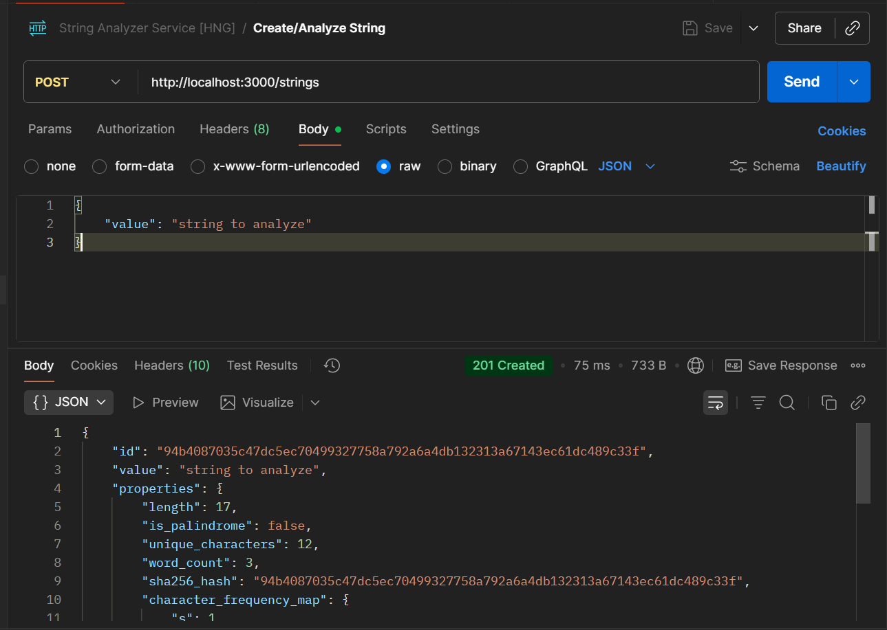
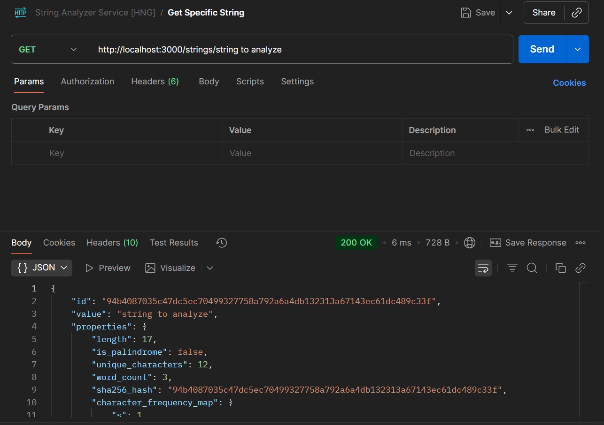
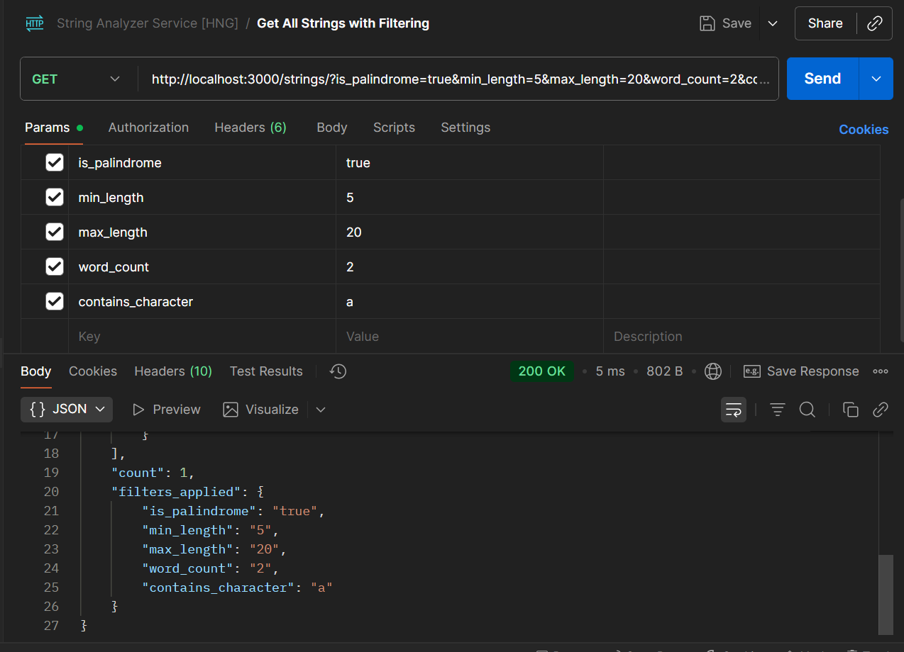
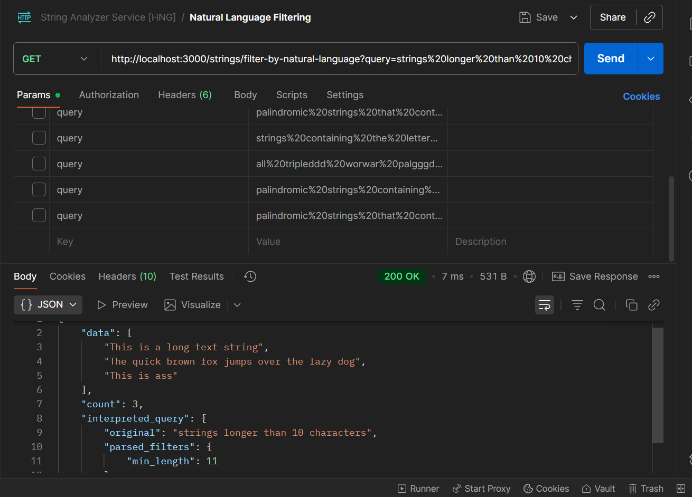
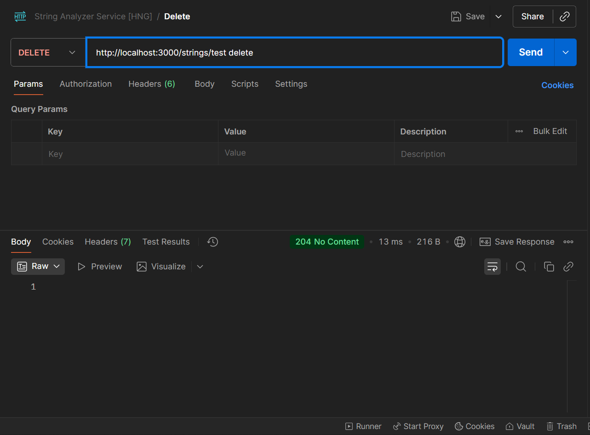

## Backend Wizards — Stage 1 Task: Build a String Analyzer Service

This project is a String Analyzer Service built using Node.js and TypeScript. It provides various functionalities to analyze strings, including checking for palindromes, filtering based on length, word count, and specific characters, as well as natural language query processing.

### Features

- Palindrome checking
- String length analysis
- Word count analysis
- Character frequency analysis
- Natural language query filtering
- Letter checking

## Dependencies

- Node.js
- TypeScript
- Express
- Nodemon
- express-rate-limit
- dotenv
- ts-node
- tsup

### Usage

1. Clone the repository:

   ```bash
   git clone https://github.com/ideateGudy/String_Analyzer_Service.git
   ```

2. Navigate to the project directory:

```bash
   cd String_Analyzer_Service
   ```

3. Install the dependencies:

   ```bash
   npm install
   ```

4. Start the development server:
   ```bash
   npm run dev
   ```


### API Endpoints
- `POST /strings`: Create and analyze a new string.



- `GET /strings/{string_value}`: Get details of a specific string



- `GET /strings`: Get all strings with optional filters.



- `GET /strings/filter-by-natural-language?query={query}`: Filter strings using natural language queries.



- `DELETE /strings/{string_value}`: Delete a string.

